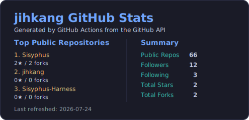

<h1 align="center">Kang Jiho (강지호)</h1>

검증 가능한 AI 실행 시스템과 geometry/mesh 알고리즘을 만드는 소프트웨어 엔지니어입니다.

---

## About

- 2025년 11월부터 2026년 4월까지 voyagergames에서 AI 백엔드 및 시스템 엔지니어링을 담당했고, 그 이전에는 2024년 7월부터 2025년 10월까지 Algorithm Korea에서 geometry/mesh processing 알고리즘과 내부 도구를 개발했습니다.
- 최근에는 개인 프로젝트로 [Sisyphus](https://github.com/jihkang/Sisyphus)를 만들고 있습니다. 목표는 AI가 그럴듯하게 말하는 시스템이 아니라, 실제 변경을 남기고 재현 가능하게 검증할 수 있는 작업 시스템을 만드는 것입니다.
- 관심 분야는 AI agent infrastructure, reproducible execution, task orchestration, verification, MCP, realtime systems 입니다.

---

## Current Focus

### Sisyphus (2026 ~ )
AI 작업을 운영 가능한 형태로 바꾸는 execution layer

- 계획, 브랜치, worktree, 실행, 검증, 종료까지 task lifecycle 전체를 기록
- conformance 추적, event bus, MCP server, verification/close workflow 구현
- direct change adoption과 self-evolution/evaluation loop 아키텍처까지 확장
- 핵심은 자동화 자체보다, 사람이 결과를 이해하고 다시 따라가고 검사할 수 있게 만드는 것

---

## Work Experience

### voyagergames (2025.11 ~ 2026.04)

- Application Engineer
- 대규모 동시 접속 환경에서 Room 시스템 병목을 분석하고 DB join 구조를 재설계해 처리량을 약 150 TPS에서 250 TPS로 개선
- FSM 기반 에이전트 오케스트레이션과 유사도/확률 기반 라우팅 로직으로 LLM 응답 흐름을 구조화
- FastAPI 기반 비동기 API 및 PromptOps 운영 환경 구축

### Algorithm Korea (2024.07 ~ 2025.10)

- Software Engineer
- C++ 기반 mesh/geometry 알고리즘 고도화 및 최적화
- 여러 mesh 통합, duplicate triangle 제거, 충돌부 보정 등 문제 해결 알고리즘 개발
- 외부 라이브러리 의존성 축소 및 테스트베드 구축
- WPF 기반 메시지 핸들링 시스템과 내부 운영 대시보드 구현

---

## Selected Projects

### [AI Multi Agent System](https://github.com/jihkang/agent) (2025.03 ~ 2025.05)
다중 에이전트 기반 AI 통신 시스템

- FastAPI + WebSocket 기반 비동기 스트리밍 서버 구현
- PlanningAgent / ToolAgent / ExecutionAgent 역할 분리
- 메시지 큐 및 상태 캐시 구조 설계로 실시간 메시지 흐름 제어
- Gemini, Llama 기반 자연어 명령 처리 파이프라인 구성

### [Transcendence](https://github.com/jihkang/transendence) (2023.06 ~ 2023.07)
실시간 게임/채팅/소셜 SPA 플랫폼

- NestJS + React 기반 게임 API 및 통신 구조 설계
- Socket.IO 기반 게임 상태 동기화 및 실시간 채팅 처리
- PostgreSQL, Docker Compose 기반 실행 환경 구성

### [IRC Chat Server](https://github.com/jihkang/42cursor/tree/main/irc_git) (2023.04 ~ 2023.05)
C++ 기반 kqueue 소켓 서버

- Server, Handler, Command, DB 구조로 계층 분리
- select + kqueue 기반 비동기 처리 구조 설계 및 구현

---

## Principles

- 저는 "잘 답하는 AI"보다 "검증 가능한 방식으로 실제 시스템을 바꾸는 AI"에 더 관심이 있습니다.
- 자동화 이후에도 사람이 결과를 이해하고 재현하고 검사할 수 있어야 한다고 생각합니다.
- 재현성, 검증 가능성, 운영 가능성을 우선합니다.

---

## Tech Stack

- Languages: C++, C#, Python, TypeScript
- Frameworks: FastAPI, Django, React, Next.js, WPF
- Infra/Tools: Git, Docker, GitHub Actions
- Communication: WebSocket, REST API, asyncio, aiohttp

---

## Education

- 42Seoul (2022.08 ~ 2024.07)
  프로젝트 기반 Peer Learning으로 C, C++, OS, 네트워크, 멀티스레딩을 집중 학습

---

## GitHub Stats

---

## Contact

- Blog: [https://mal-o.tistory.com](https://mal-o.tistory.com)
- Email: mallangcoogi@gmail.com
- GitHub: [https://github.com/jihkang](https://github.com/jihkang)
